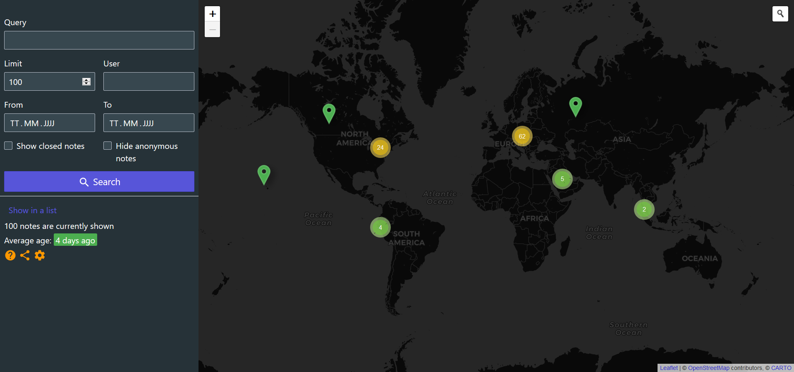

<h1 align="center">
	
</h1>

> Tool for solving OpenStreetMap Notes

Displays OpenStreetMap Notes in a way it is fun working with them 😎

Notes are a very important part of the OpenStreetMap ecosystem. Every user of the map can report missing things or outdated details. But very often the notes are never resolved at all which could lead to frustrated users 😞. This website provides a better way to resolve notes and improve the map. ✔️

## Features

- 📍 Notes can be viewed either on a map or in a list
- ✂️ Useful filters to show only the notes you are interested in
- 💬 View all comments of a note directly on the website
- ✍️ Open your favorite editor directly in order to process the note
- 💬 Comment on every note directly using the interface
- 🛣️ Integration of [Mapillary](https://www.mapillary.com/) street-level imagery
- 📷 Automatic detection of images on image hosting servers
- 🔦 A dark mode (for working at night 😉)

## Contributing

You can help by translating the website into your language at POEditor.

Follow [**this link** to improve the translations](https://poeditor.com/join/project/oVilUChBdf):

You found an issue or want to propose a new feature? Then please use the [issue tracker](https://github.com/ENT8R/NotesReview/issues/) of this repository.

---

For further information on how to contribute you might also want to read the [contributing guidelines](https://github.com/ENT8R/NotesReview/blob/main/CONTRIBUTING.md).

## Screenshots

 
 
 

## License

NotesReview is available under the [GNU GPL-3.0 License](https://opensource.org/licenses/GPL-3.0).
See the [LICENSE](LICENSE) file for more details.
