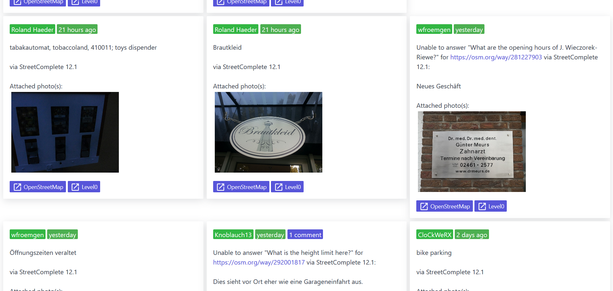

<h1 align="center">
	
</h1>

> Tool for solving OpenStreetMap Notes

   

Displays OpenStreetMap Notes in a way it is fun working with them 😎

Notes are a very important part of the OpenStreetMap ecosystem. Every user of the map can report missing things or outdated details. But very often the notes are never resolved at all which could lead to frustrated users 😞. This website provides a better way to resolve notes and improve the map. ✔️

## Highlights

- 📍 Notes can be viewed either on a map or in a list
- ✂️ Useful filters to show only the notes you are interested in
- 💬 View all comments of a note directly on the website
- ✍️ Open your favorite editor directly in order to process the note
- 📷 Automatic detection of images on image hosting servers
- 🔦 A dark mode (for working at night 😉)

## Contributing

You can help by translating the website into your language at POEditor.

Follow [**this link** to improve the translations](https://poeditor.com/join/project/oVilUChBdf):

You found an issue or want to propose a new feature? Then please use the [issue tracker](https://github.com/ENT8R/NotesReview/issues/) of this repository.

If you want to support the development of this software, I am very thankful to receive any donations 🤗

## Screenshots

 
 
 

## License

NotesReview is available under the [GNU GPL-3.0 License](https://opensource.org/licenses/GPL-3.0).
See the [LICENSE](LICENSE) file for more details.
